# BookVerse - Quick Start Guide

Online bookstore and book marketplace with an administrative panel and a customer-facing user interface.

---

## Prerequisites

**Backend:**

- .NET 8 SDK
- SQL Server, port 1433

**Frontend:**

- Node.js 18+

---

## Secrets configuration (.env)

Secret variables (connection string, JWT key, Stripe API keys, email and CAPTCHA settings) are stored in a `.env` file that is **not committed** to the repository.

A zipped file is available in the repository:

```
BookVerse/backend/BookVerse.API/.env-tajne.zip
```

Extract the zip and place the `.env` file in the directory below. The password to open the zip archive is sent by email on request — contact the project author: suana.mesic@edu.fit.ba

```
BookVerse/backend/BookVerse.API/.env
```

`.env` file structure:

```
ConnectionStrings__Main=...
Jwt__Key=...
EmailSettings__Username=...
EmailSettings__Password=...
EmailSettings__FromEmail=...
Stripe__SecretKey=...
Stripe__PublishableKey=...
Stripe__WebhookSecret=...
CaptchaOptions__SecretKey=...
```

---

## Running the backend

```bash
cd BookVerse/backend
dotnet run --project BookVerse.API
```

The backend runs at: `https://localhost:7260`

Migrations are applied automatically on startup (`MigrateAsync`). Static seed data (users, books, categories, etc.) is embedded in the migrations via `HasData` and is applied alongside them. There is no need to run `dotnet ef database update` manually.

---

## Stripe webhooks (local payment testing)

For payments to work locally, install the [Stripe CLI](https://stripe.com/docs/stripe-cli) and run the following in a separate terminal:

```bash
stripe listen --forward-to https://localhost:7260/OrdersOrderItems/stripe-webhook
```

When the Stripe CLI starts it prints a webhook secret (`whsec_...`) — that key needs to be added to `.env` as `Stripe__WebhookSecret`, and the backend must be restarted.

Without this step Stripe will not deliver webhook events to the local backend, so orders will not be marked as paid after a successful payment in the Stripe form.

For payment testing use [test cards](https://stripe.com/docs/testing#cards), e.g. `4242 4242 4242 4242` (successful payment), any future date, and any CVC.

---

## Running the frontend

```bash
cd BookVerse/frontend/bookverse-frontend
npm install
npm start
```

The frontend opens at: `http://localhost:4200`

---

## Login credentials

| Email                  | Password | Role                |
| ---------------------- | -------- | ------------------- |
| admin@bookverse.com    | string   | Admin (full access) |
| manager@bookverse.com  | string   | Manager             |
| employee@bookverse.com | string   | Employee            |
| customer@bookverse.com | string   | Customer            |

Swagger is available at `https://localhost:7260/swagger` and can be used with the same credentials.

---

## Features

**Admin panel:**

- User management (RBAC — admin, manager, employee)
- Management of books, categories, authors, publishers, formats, and inventory
- View and update order statuses
- Reports (PDF, CSV)
- Realtime notifications via SignalR

**Customer interface:**

- Browse and search books with filters (categories, authors, format)
- Detailed book page with reviews and a map of bookstore locations
- Shopping cart, checkout via Stripe
- Order status tracking
- Profile and settings management (theme, language)
- Multilingual — Bosnian and English (content translation via the Google Translate API)
- reCAPTCHA protection on registration

---

## Backend architecture

The backend follows Clean Architecture with separate layers:

```
BookVerse.Domain        — domain classes and entities
BookVerse.Application   — business logic, CQRS (MediatR), interfaces
BookVerse.Infrastructure — EF Core, migrations, services (email, translation, Stripe)
BookVerse.API           — controllers, middleware, SignalR hubs
BookVerse.Shared        — shared constants
BookVerse.Tests         — integration tests
```

---

## Technologies used

**Backend:** ASP.NET Core 8, Entity Framework Core 8, SQL Server, MediatR (CQRS), SignalR, Stripe.net, JWT authentication

**Frontend:** Angular 21, Angular Material, ngx-translate, Stripe.js, Leaflet

---

## Screenshots

### Login

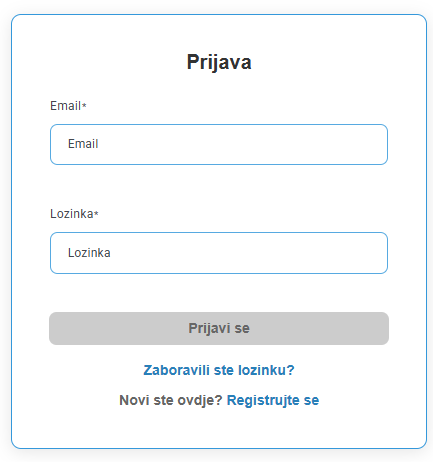

### Admin panel - dashboard

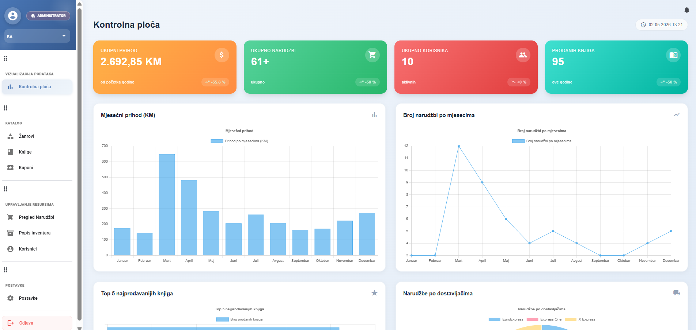

### Admin panel - books

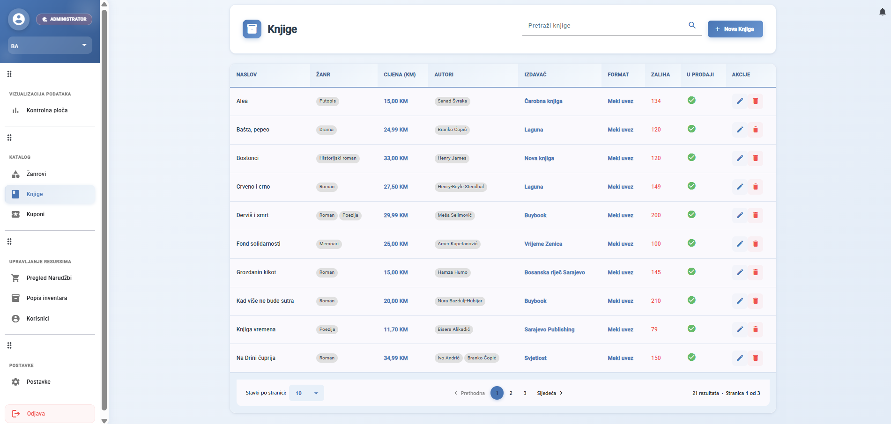

### Admin panel - orders

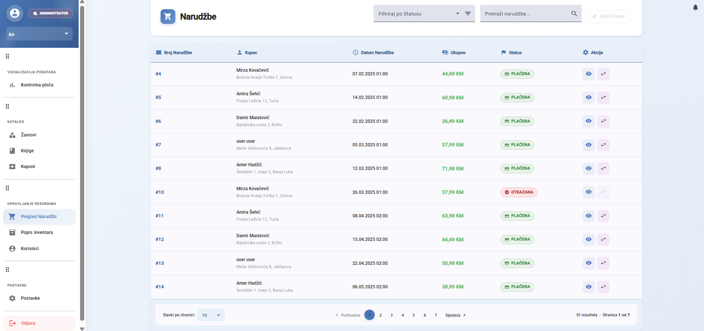

### Admin panel - orders (dark)

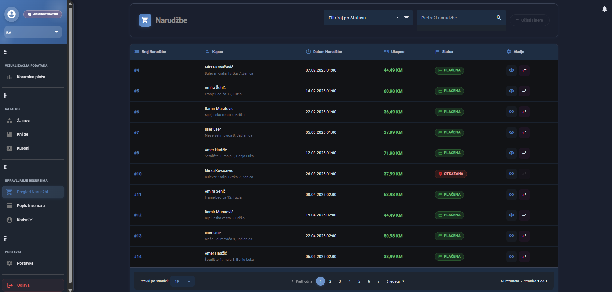

### Admin panel - inventory

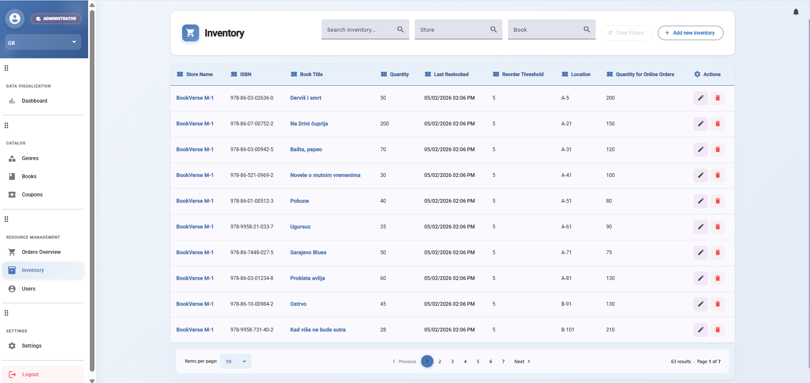

### Admin panel - users

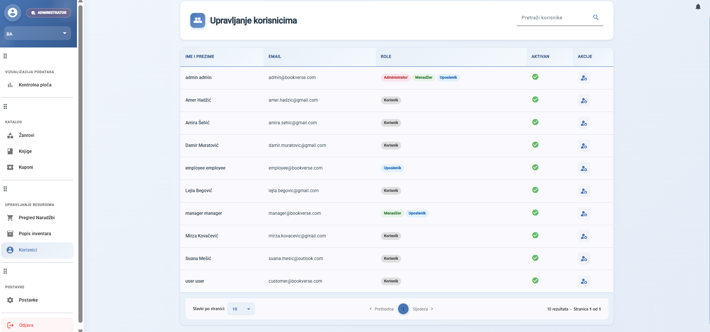

### Admin panel - settings

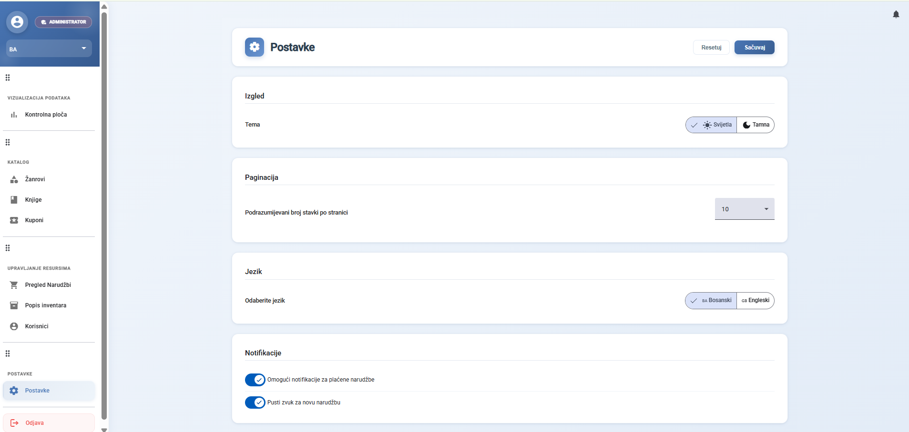

### Customer interface - book listing

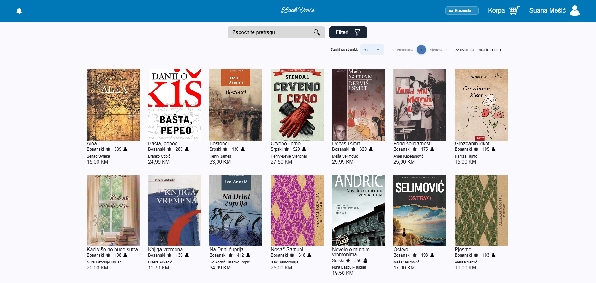

### Customer interface - book listing (dark)

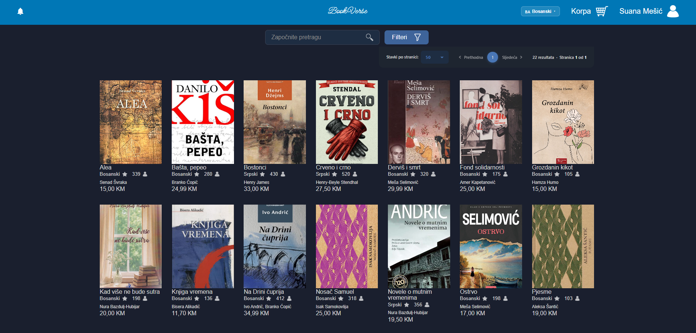

### Customer interface - shopping cart

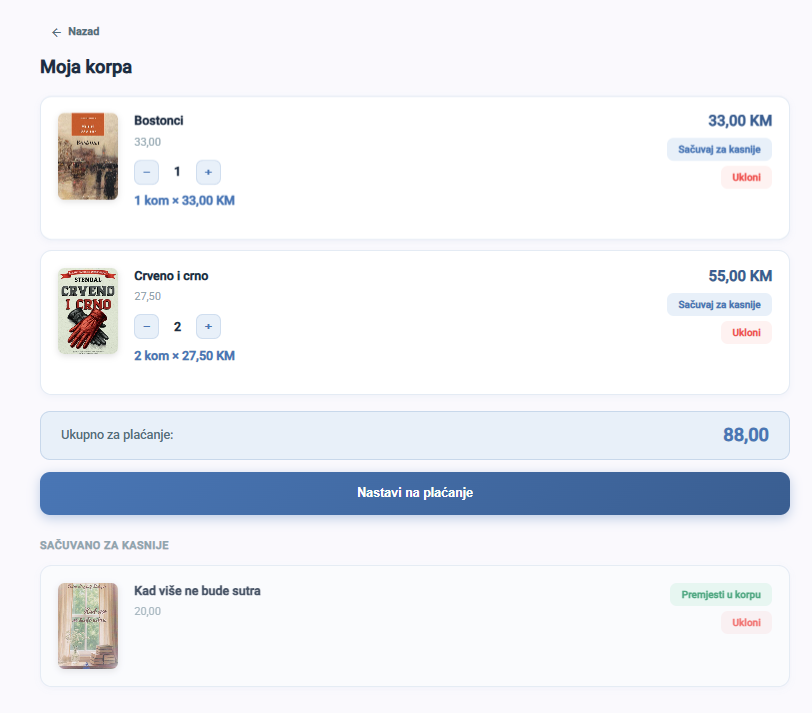

### Customer interface - my orders

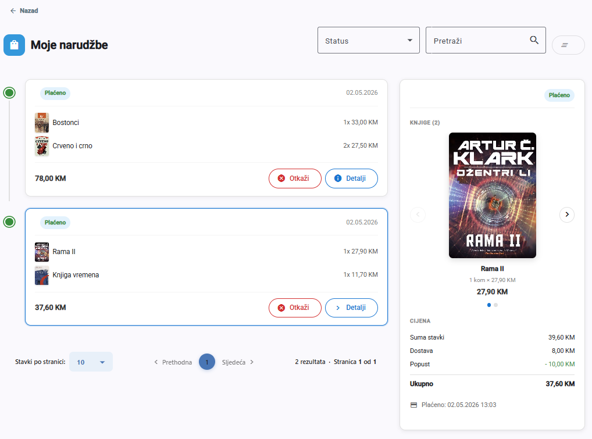

### Customer interface - my purchased books

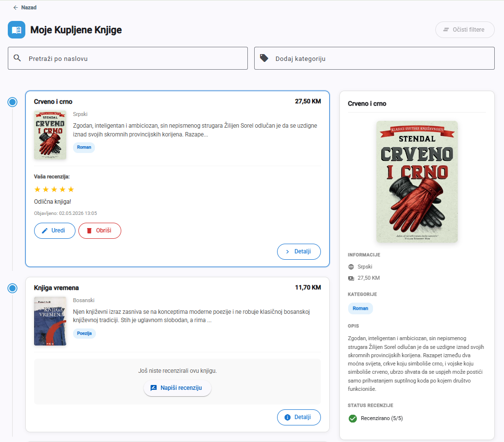

### Customer interface - reviewing (only for purchased books)

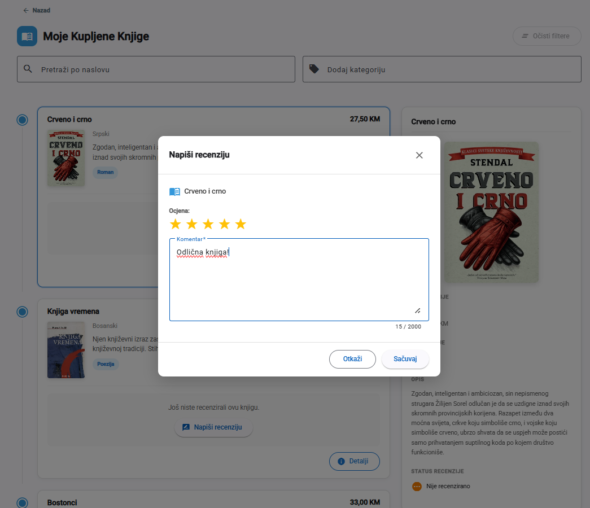
