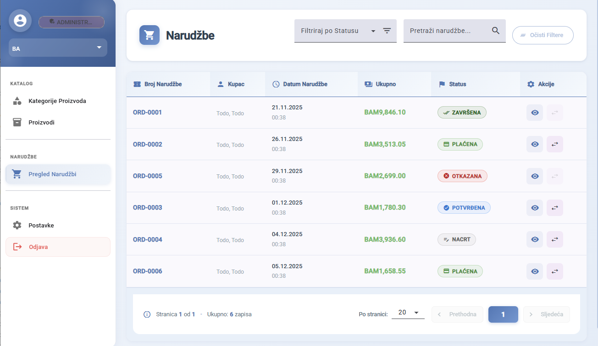

# BookVerse - Brzi Vodič

Online knjižara i tržište knjiga s administrativnim panelom i korisničkim sučeljem.

---

## Preduvjeti

**Backend:**
- .NET 8 SDK
- SQL Server (lokalno ili Docker), port 1433
- Docker (opcionalno, za SQL Server kontejner)

**Frontend:**
- Node.js 18+

---

## Konfiguracija tajni (.env)

Tajne varijable (konekcijski string, JWT ključ, Stripe API ključevi, email i CAPTCHA podaci) se čuvaju u `.env` fajlu koji se **ne commituje** u repozitorij.

U repozitoriju se nalazi zipovani fajl:
```
BookVerse/Market.Backend/Market.API/.env-tajne.zip
```

Potrebno je raspakovati zip (lozinka je poslana odvojeno putem e-maila) i postaviti `.env` fajl u direktorij:
```
BookVerse/Market.Backend/Market.API/.env
```

Struktura `.env` fajla:
```
ConnectionStrings__Main=...
Jwt__Key=...
EmailSettings__Username=...
EmailSettings__Password=...
EmailSettings__FromEmail=...
Stripe__SecretKey=...
Stripe__PublishableKey=...
Stripe__WebhookSecret=...
CaptchaOptions__SecretKey=...
```

---

## Pokretanje backenda

```bash
cd BookVerse/Market.Backend
dotnet run --project Market.API
```

Backend se pokreće na: `https://localhost:7260`

Migracije se primjenjuju automatski pri pokretanju (`MigrateAsync`). Statički seed podaci (korisnici, knjige, kategorije...) su ugrađeni u migracije putem `HasData` i primjenjuju se zajedno s njima. Nema potrebe za ručnim pokretanjem `dotnet ef database update`.

---

## Pokretanje frontenda

```bash
cd BookVerse/Market.Frontend/rs1-frontend-2025-26
npm install
npm start
```

Frontend se otvara na: `http://localhost:4200`

---

## Pristupni podaci

| Email | Lozinka | Rola |
|-------|---------|------|
| admin@bookverse.com | string | Admin (sve ovlasti) |
| manager@bookverse.com | string | Manager |
| employee@bookverse.com | string | Zaposlenik |
| user@bookverse.com | string | Korisnik |

Swagger je dostupan na `https://localhost:7260/swagger` i može se koristiti s istim podacima.

---

## Mogućnosti

**Admin panel:**
- Upravljanje korisnicima (RBAC — admin, manager, zaposlenik)
- Upravljanje knjigama, kategorijama, autorima, izdavacima, formatima i zalihama
- Pregled i promjena statusa narudzbi
- Izvjestaji (PDF, CSV)
- Realtime notifikacije putem SignalR

**Korisničko sučelje:**
- Pregled i pretraga knjiga s filterima (kategorije, autori, format)
- Detaljna stranica knjige s recenzijama i mapom lokacija knjižara
- Košarica, naplata putem Stripe-a
- Praćenje statusa narudžbi
- Upravljanje profilom i postavkama (tema, jezik)
- Višejezičnost — bosanski i engleski (prijevod sadrzaja putem Google Translate API-ja)
- reCAPTCHA zastita na registraciji

---

## Arhitektura backenda

Backend prati Clean Architecture s odvojenim slojevima:

```
Market.Domain       — domenske klase i entiteti
Market.Application  — business logika, CQRS (MediatR), interfejsi
Market.Infrastructure — EF Core, migracije, servisi (email, prijevod, Stripe)
Market.API          — kontroleri, middleware, SignalR hubovi
Market.Shared       — zajednicke konstante
Market.Tests        — integracijski testovi
```

---

## Korištene tehnologije

**Backend:** ASP.NET Core 8, Entity Framework Core 8, SQL Server, MediatR (CQRS), SignalR, Stripe.net, JWT autentifikacija

**Frontend:** Angular 21, Angular Material, ngx-translate, Stripe.js, Leaflet

---

## Screenshotovi

### Početna stranica

